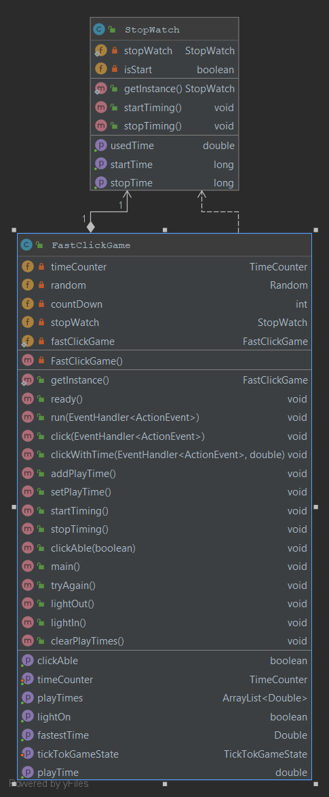
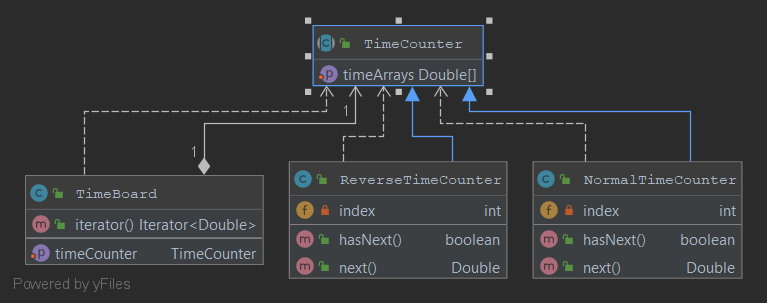
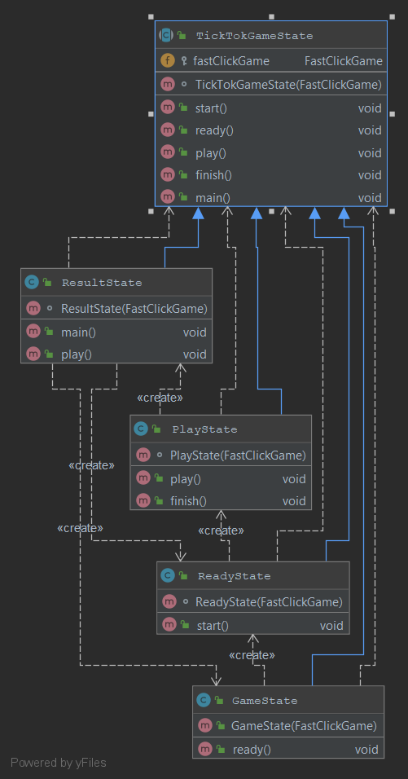

# Tick Tok Game (Fast Click game)

[x] Manusporn Fukkham KUid.6010546702

This game is easy. You just need to click the button when the light is
on. Its will calculate how fast you click.

## Design Pattern
I use **Singleton**, **State** and, **Iteration** design pattern

### Singleton
In the Singleton i have `StopWatch` and `FastClickGame` which represent 
single class create.

### Iteration
The `TimeCounter` be Interator and `TimeBoard` be Iterable. TimeBoard use
Strategy of TimeCounter to present which have *Normal* and *Reverse* strategy.
On this game its use `ReverseTimeCounter` to represent latest play first.

### State
They are 4 State on this game `GameState`(Main Page), `ReadyState`, `PlayState`
and, `ResultState` which of recreate State every changing State.

